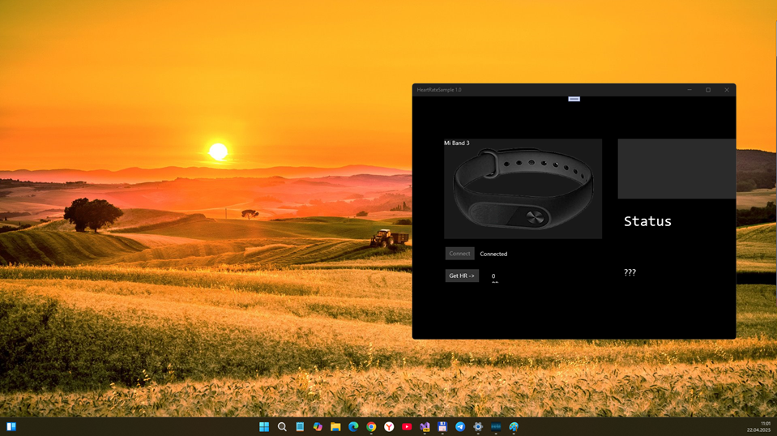

# Mi Band 3 SDK v1.0-alpha - master branch

## About
This is some result of my MiBand3 SDK micro-RnD. I planned it for pairing and interacting with Mi Band 3 via .NET and UWP... but all experiments failed. :(

## Project Description
This project was written to interact Mi Band 3 from UWP applications.

## Screenshots

## System Requirements

You need installed Visual Studio with UWP on the board.

Minimum version: Windows 10.0.10586  (and 10.0.14393 for HeartRateSample project!)

## Example

HeartRateSample project included (as some Mi Band 3 showcase/example).

## State / Status of experiments

- Mi Band 3 SDK seem to be uncomplete. I detected some device connection bugs.  

## References

- https://github.com/MalveiraAlexander/Mi-Band-3-SDK
- https://github.com/AL3X1/Mi-Band-2-SDK
- https://github.com/Davo911/HeartRateSample

## ..
As is. No support. RnD only. DIY

## .
[M][E] 2025
